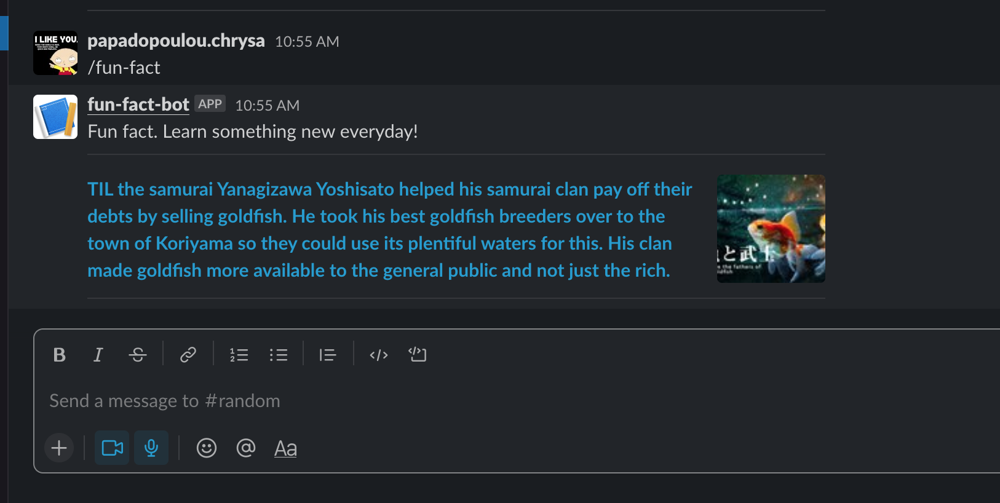

# How to install and run

*development*

```
yarn
yarn dev
```

*production*

```
yarn
yarn build
yarn start
```

# How to create a slack bot

- [Slack Documentation](https://slack.com/help/articles/115005265703-Create-a-bot-for-your-workspace)

All details on how to create a Slack bot are explained under the `Slack Documentation`. Once you have created a slack app, navigate to your slack app under `slash commands` and connect the slash command with the endpoint of the fun-fact app and just follow rest prompted steps.

# End result



## successful response

```
{
    "response_type": "in_channel",
    "blocks": [
        {
            "type": "section",
            "text": {
                "type": "mrkdwn",
                "text": "Fun fact. Learn something new everyday!"
            }
        },
        {
            "type": "divider"
        },
        {
            "type": "section",
            "text": {
                "type": "mrkdwn",
                "text": "*<https://en.wikipedia.org/wiki/Jet_(song)|TIL that the Wings song \"Jet\" was named based on Paul McCartney's Labrador Retriever named Jet.>*\n"
            },
            "accessory": {
                "type": "image",
                "image_url": "https://b.thumbs.redditmedia.com/cAmk9wNXEbwZMrCZgM1NhCNbPuWQUhFJ5aDMWusFP-s.jpg",
                "alt_text": "Fact thumbnail"
            }
        },
        {
            "type": "divider"
        }
    ]
}
```

## error response

```
{
    "response_type": "in_channel",
    "blocks": [
        {
            "type": "section",
            "text": {
                "type": "mrkdwn",
                "text": ":crying_cat_face: Something went wrong. Please try again."
            }
        }
    ]
}
```
